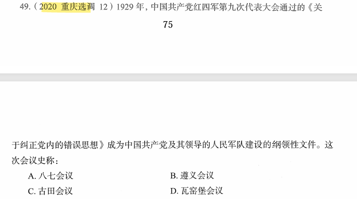

# 错题 81：政治/历史-古田会议与党的建设

**来源**：

点击查看答案

<b>你的答案</b>：B 
<b>正确答案</b>：C  
<b>详细解答</b>： 《关于纠正党内的错误思想》是由毛泽东同志起草的著名的古田会议决议的第一部分，是在中国人民最困难的时期里指导革命势力使之重新发展起来的一份重要文件。它第一次系统完整地按照马克思列宁主义的原理解决了如何使军队成为革命的人民军队的问题，同时也解决了如何建立一个能够领导革命斗争使之走向胜利前途的布尔什维克化的共产党的问题，成为中国共产党及其领导的人民军队建设的纲领性文献。  
<b>错误原因</b>：不熟悉古田会议相关史实

