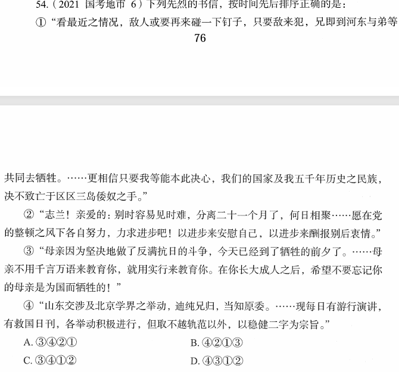

# 错题 82：历史-抗日战争时期重要历史人物与事件

**来源**：

点击查看答案

<b>你的答案</b>：C 
<b>正确答案</b>：D  
<b>详细解答</b>： ①这封信是1940年5月1日枣宜会战前夕张自忠亲笔书写昭告各将领、各部队的书信。枣宜会战中，张自忠将军身负七处重伤，壮烈殉国，成为抗战期间中国军队中牺牲的最高将领、二战中盟军牺牲的最高将领。  
②这封家书是1942年5月22日左权将军壮烈殉国前三天写给爱妻刘志兰的最后一封信。由信中"党的整顿之风"可判断当时党内正开展整风运动。  
③这封信是1936年赵一曼写给儿子的遗书。九一八事变后，日本帝国主义于1932年在长春成立了伪满洲国傀儡政权。信中"反满抗日"指的便是东北人民反抗伪满洲国的抗日活动，此时处于东北局部抗战时期。  
④这封信是1919年5月17日闻一多写给父母的家书。信中"山东交涉及北京学界之举动""现每日有游行演讲"等交代了当时北京学界游行演讲是为了争取山东主权，处于五四运动时期。  
<b>错误原因</b>：未正确理解③信中的"反满抗日"一词，误以为是清末时期

