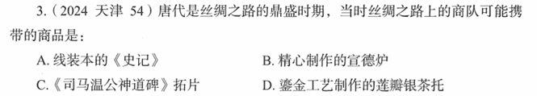

# 错题 84：历史-唐代丝绸之路商品与工艺发展史

**来源**：2024年天津卷第54题

点击查看答案

<b>你的答案</b>：A 
<b>正确答案</b>：D  
<b>详细解答</b>： A项错误:线装书是指以线类进行装订的图书类型,又称古线装。中国古代的纸本书,经历了卷轴和册页两个阶段。卷轴由卷、轴、缥、带组成。汉代、唐代只有以卷轴形式装订的书。宋代是书籍印刷爆发的时代,开始出现多种多样的装订方法。宋代是书籍装订形式大发展时期与奠定时期,不仅蝴蝶装、包背装等产生于宋代,线装书也产生于宋代。因此,唐代丝绸之路上的商队不可能携带线装本的《史记》。  D项正确:鎏金是一种金属加工工艺,始于战国。中国是世界上最早使用这一技术的国家。1957年,陕西省西安市唐长安城平康坊遗址出土了唐朝鎏金莲瓣银茶托,茶托盘底心下凹,周围有凸起托圈。因此,唐代丝绸之路上的商队有可能携带鎏金工艺制作的莲瓣银茶托。  
<b>错误原因</b>：对相关史实不了解

