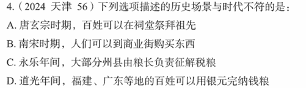

# 错题 85：历史-祠堂制度发展史

**来源**：2024年天津卷第56题

点击查看答案

<b>你的答案</b>：C 
<b>正确答案</b>：A  
<b>详细解答</b>： A项错误:祠堂是供奉与祭祀祖先或先贤的场所。"祠堂"这一名称最早出现于汉代,从秦汉到北宋,只有王公贵族和士大夫官员有资格建祠堂,民间不得立祠。南宋时,理学家朱熹著《家礼》立祠堂之制,创建祠堂以敬祖,民间祠堂有所发展。故唐玄宗时期,百姓不可能在祠堂祭拜祖先。  C项正确:粮长制,始创于洪武四年(1371年),是中国明代在全国大部分州县实行的由粮长负责征解税粮的制度。粮长的主要任务是负责本区的税粮催征、经收、解运诸事宜,后来其职权范围有所扩大,也行使拟订田赋科则、编造鱼鳞图册、检举流人户等职责。嘉靖后,实行一条鞭法,裁粮归里,粮长的职责由里长担任。  
<b>错误原因</b>：不了解"祠堂相关史实"

