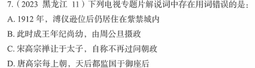

# 错题 86：历史-监国与垂帘听政的区别

**来源**：2023年黑龙江第11题

点击查看答案

<b>你的答案</b>：C 
<b>正确答案</b>：D  
<b>详细解答</b>： C项正确:南宋绍兴三十二年(1162年),宋高宗赵构把皇位禅让给养子--皇太子赵脊,是为宋孝宗。宋高宗在位共36年,又做了25年太上皇,死于淳熙十四年(1187年),享年81岁。虽然宋高宗自称不再过问朝政,但实际上他仍然牢牢掌控着南宋帝国的军政大权。  D项错误:自从处死上官仪之后,唐高宗每次上朝议政,天后(武则天)都坐在皇帝宝座的后面参与听政,中间隔着垂下的帘子。朝廷政务,事无巨细,她都要干预,因此朝野内外把她和皇帝一并尊称为"二圣"。监国,中国古代的一种政治制度,通常是指皇帝外出时,由一重要人物(通常为皇太子)留守宫廷代为处理国事。垂帘听政不同于监国。  
<b>错误原因</b>：对相关史实不了解

