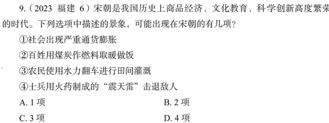

# 错题 87：历史-宋朝科技与社会生活

**来源**：2023年福建中考历史第6题

点击查看答案

<b>你的答案</b>：C 
<b>正确答案</b>：D  
<b>详细解答</b>： ②正确:早在距今约3500年前,中国人就发现了煤炭,并进行了开采和利用。当时还不叫煤炭,而是称作湮石、石涅、黑丹等。对煤炭被大量用于生产和生活的明确记载是在汉代。除了冶铁、烧饭,有记载表明,南北朝时期人们还用煤炭来取暖。因此,"百姓用煤炭作燃料取暖做饭"有可能出现在宋朝。  ③正确:宋朝时,人们对人力翻车加以改进,创造出畜力翻车和水转翻车。水转翻车与牛转翻车结构相似,只是在由牛来带动的卧齿轮轮轴的下端安装一个水轮,使用时将翻车置于水流湍急处,以水力转动翻车将水提上岸。如果水势适当,则卧轮和水轮都可省掉,把原来的立齿轮改成可以受力的水轮,带动翻车轮轴转动以提水。因此,"农民使用水力翻车进行田间灌溉"有可能出现在宋朝。  ④正确:据史料记载,"震天雷"是出现在北宋末年的一种火药武器,在南宋和元朝时期的战事中得到了广泛应用。根据实际使用需求的不同,"震天雷"可以制作成各种形状,可以用人力投掷,也可以用投石机发射。因此,"士兵用火药制成的'震天雷'击退敌人"有可能出现在宋朝。  
<b>错误原因</b>：不了解"翻车"相关史实

