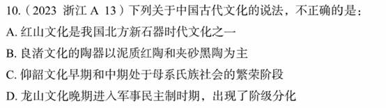

# 错题 88：历史-中国古代文化-良渚文化

**来源**：2023年浙江A卷第10题

点击查看答案

<b>你的答案</b>：C 
<b>正确答案</b>：B  
<b>详细解答</b>： 浙江出的题如果不知道答案应该无脑蒙和浙江相关的。  B项错误:良渚文化是浙江地区的新石器时代文化,其陶器特征是以泥质**黑陶**和夹砂**灰陶**为主,而非"泥质红陶和夹砂黑陶"。良渚文化的黑陶制作工艺精湛,是其重要文化特征之一。  
<b>错误原因</b>：不会蒙题

