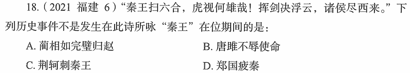

# 错题 89：历史-秦始皇在位期间的历史事件

**来源**：2021年福建高考第18题

点击查看答案

<b>你的答案</b>：C 
<b>正确答案</b>：A  
<b>详细解答</b>： A项错误:蔺相如完璧归赵发生于战国时期,讲述的是秦昭王许诺赵王以15座城池来换取和氏璧,但当使臣蔺相如献璧之后,秦昭王却不提换城之事,蔺相如急中生智,施巧计使和氏璧重归赵国。蔺相如完璧归赵并非发生在秦始皇赢政在位期间。  B项正确:唐雎不辱使命讲述的是唐雎奉安陵君之命出使秦国,与秦王展开面对面的激烈争论,终于折服秦王、保存国家、完成使命的历史事件,歌颂了唐雎不畏强暴、敢于斗争的爱国精神。该事件中的秦王就是秦始皇赢政,当时他还未称皇帝。  C项正确:荆轲刺秦王讲述了战国时期荆轲刺杀秦王赢政这一悲壮的历史故事,反映了当时的社会政治情况,表现了荆轲重义轻生、为燕国勇于牺牲的精神。  D项正确:郑国疲秦中的郑国是韩国派往秦国的一个间谍,韩桓王试图通过他游说秦王赢政修筑一条连接泾水和洛水的运河,以收疲秦之效,阻止秦国进攻韩国的步伐。岂知事与愿违,"疲秦之计"反而成了"强秦之策",运河的成功修筑使得一向落后的关中农业迅速发展起来。  
<b>错误原因</b>：读题错误+对相关史实不了解

