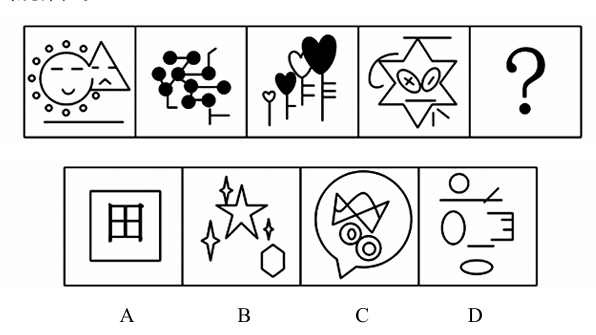

# 错题 9：图形推理-数量类-线（横线数）

**来源**：决战行测5000题（上册）- 数量规律-线 - 夯实基础第5题

点击查看答案

<b>你的答案</b>：C 
<b>正确答案</b>：D  
<b>详细解答</b>： 元素组成不同，且无明显属性规律，考虑数量规律。观察发现，题干图形出现多条单一直线，且均为横线，优先考虑数横线。故问号处图形的横线数也应为6，只有D项符合。  
<b>错误原因</b>：未发现横线成规律

