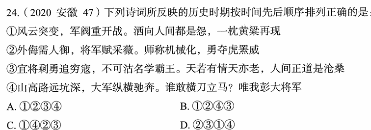

# 错题 90：历史-毛泽东诗词反映的历史时期排序

**来源**：2020年安徽第47题

点击查看答案

<b>你的答案</b>：A 
<b>正确答案</b>：C  
<b>详细解答</b>： ①"风云突变,军阀重开战。洒向人间都是怨,一枕黄梁再现"出自毛泽东的《清平乐·蒋桂战争》。这首词反映的是1929年春发生于国民党南京军阀蒋介石和广西(简称"桂")军阀李宗仁、白崇禧之间的战争,即蒋桂战争。  ②"外侮需人御,将军赋采薇。师称机械化,勇夺虎黑威"出自毛泽东的《五律·挽戴安澜将军》。1942年,中国远征军第5军第200师师长戴安澜率部赴缅甸援英抗日,历经血战,不幸殉国,年仅38岁。此诗为毛泽东为戴安澜将军写的挽诗。  ③"宜将剩勇追穷寇,不可沽名学霸王。天若有情天亦老,人间正道是沧桑"出自毛泽东的《七律·人民解放军占领南京》。该诗写于1949年,热情歌颂了人民解放军飞渡长江天堑、解放南京、改造黑暗旧社会的光辉史实,并以富有哲理意味的诗句阐发了"追穷寇"的深刻军事哲理。  ④"山高路远坑深,大军纵横驰奔。谁敢横刀立马?唯我彭大将军"出自毛泽东的《六言诗·给彭德怀同志》。1935年10月,彭德怀在吴起镇战斗中歼敌一个团,击溃三个团,毛泽东立即挥毫赋诗一首,赞扬彭德怀杰出的军事指挥才能。  正确顺序为:①(1929年)④(1935年)②(1942年)③(1949年)  
<b>错误原因</b>：误以为④诗反映的是抗美援朝时期

