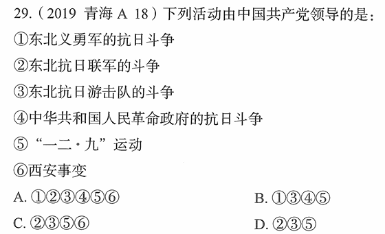

# 错题 91：历史-中国共产党领导的抗日活动

**来源**：2019年青海A卷第18题

点击查看答案

<b>你的答案</b>：A 
<b>正确答案</b>：D  
<b>详细解答</b>： 排除法。根据⑥排除A、C,根据④排除B,故选D。  ②正确:东北抗日联军是在中国共产党领导下的一支英雄部队,是中国人民解放军的前身之一。  ③正确:东北抗日游击队是中国共产党领导下的抗日武装力量,后来发展成为东北抗日联军。  ⑤正确:"一二·九"运动是1935年12月9日在中国共产党领导下,北平(北京)学生发起的抗日救国示威游行运动。  ①错误:东北义勇军是九一八事变后东北各阶层民众自发组织的抗日武装,不是由中国共产党直接领导。  ④错误:中华苏维埃人民共和国临时中央政府(非"革命政府")成立于1931年,虽然由中国共产党领导,但题目中的表述"中华人民共和国革命政府"不准确,且该政府主要任务是反对国民党统治,而非专门的抗日斗争组织。  ⑥错误:西安事变是1936年12月12日张学良、杨虎城发动的兵谏事件,虽然中国共产党在和平解决西安事变中发挥了重要作用,但西安事变本身不是由中国共产党领导发动的。  
<b>错误原因</b>：排除法使用不当

