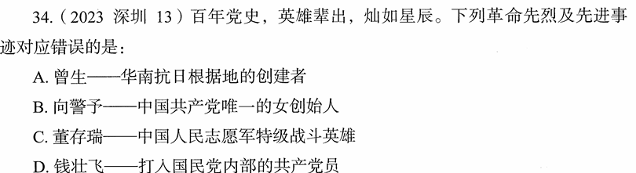

# 错题 92：历史-革命先烈及先进事迹

**来源**：2023年深圳中考历史第34题

点击查看答案

<b>你的答案</b>：A 
<b>正确答案</b>：C  
<b>详细解答</b>： C项错误:董存瑞,河北省张家口市怀来县人,中国共产党党员。1948年5月,在中国人民解放军攻打隆化城的战斗中,董存瑞用自己的身体充当支架--手托炸药包,舍身炸碉堡。他牺牲时,未满19岁。董存瑞是解放战争时期的英雄,而非"中国人民志愿军特级战斗英雄"。中国人民志愿军特级战斗英雄是抗美援朝时期的荣誉称号,如杨根思、黄继光等。  A项正确:曾生是华南抗日根据地的主要创建者之一,领导东江纵队进行抗日斗争。  B项正确:向警予是中国共产党唯一的女创始人,中共早期重要领导人之一。  D项正确:钱壮飞是打入国民党内部的中共地下党员,在中央特科工作,为保卫党中央作出重要贡献。  
<b>错误原因</b>：不了解董存瑞的事迹

