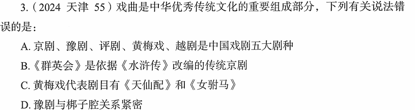

# 错题 93：历史-中国戏曲常识

**来源**：2024年天津第55题

点击查看答案

<b>你的答案</b>：C 
<b>正确答案</b>：B  
<b>详细解答</b>： B项错误:《群英会》是京剧的传统剧目,但它是根据《三国演义》改编的,而非《水浒传》。该剧讲述的是三国时期周瑜设下群英会,蒋干中计的故事。  A项正确:京剧、豫剧、评剧、黄梅戏、越剧被称为中国戏曲五大剧种。  C项正确:黄梅戏的代表剧目确实有《天仙配》和《女驸马》,这两部都是黄梅戏的经典作品。  D项正确:豫剧与梆子腔关系紧密,豫剧又称河南梆子,属于梆子腔系统。  
<b>错误原因</b>：不熟悉戏曲相关知识

