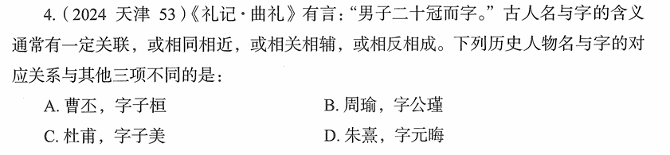

# 错题 94：历史-古人名与字的关系

**来源**：2024年天津第53题

点击查看答案

<b>你的答案</b>：B 
<b>正确答案</b>：D  
<b>详细解答</b>： 古人取字十分讲究,字一般和自己的名有关联,有如下三种取字方法: 1. 字和名意义相同,称为"并列式" 2. 字和名意思相近,但不完全相同,可以互为辅助,称为"辅助式" 3. 字和名意思相反,称为"矛盾式"  A项:曹丕,字子桓。"丕"字在《说文解字》中的释义为"大","桓"有"大"的意思。名和字意义相同,属于"并列式"。  B项:周瑜,字公瑾。"瑜"和"瑾"均指美玉,出自《楚辞·九章·怀沙》中"怀瑾握瑜兮,穷不知所示"。名和字意义相同,属于"并列式"。  C项:杜甫,字子美。"甫"是古代男子的美称;"子美"是男人长得好看的意思。名和字意义相同,属于"并列式"。  D项:朱熹,字元晦。"熹"为明亮之意,而"晦"则有昏暗的意思。名与字意义相反,属于"矛盾式",与其他三项不同。  本题为选非题,故正确答案为D。  
<b>错误原因</b>：没看出曹丕和杜甫的取字逻辑

