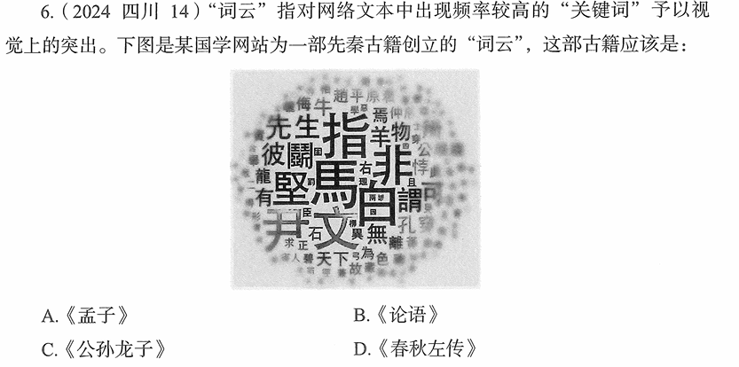

# 错题 95：历史-先秦古籍识别-公孙龙子

**来源**：2024年四川第6题

点击查看答案

<b>你的答案</b>：D 
<b>正确答案</b>：C  
<b>详细解答</b>： 由图中"白""马""非"等高频词联想到《公孙龙子·白马论》中的著名论断"白马非马"。  C项正确:《公孙龙子》是战国时期名家学派代表人物公孙龙的著作,其中最著名的是《白马论》,提出了"白马非马"的命题。词云中出现的"白""马""非""指"等关键词正是《公孙龙子》的核心概念。"白马非马"是公孙龙提出的著名逻辑命题,认为"白马"这个概念与"马"这个概念不同,"白"是形容颜色的,"马"是形容形体的,两者结合成"白马",是一个新的概念,不等同于"马"。  A项:《孟子》主要记录孟子的言行,核心思想是"性善论""仁政""民贵君轻"等,高频词应该是"仁""义""民""王"等。  B项:《论语》记录孔子及其弟子的言行,核心思想是"仁""礼""学"等,高频词应该是"子曰""仁""礼""学"等。  D项:《春秋左传》是编年体史书,记录春秋时期各国历史事件,高频词应该是国名、人名、"公""侯""伯"等。  
<b>错误原因</b>：未能从词云中的"白""马""非"联想到"白马非马"论

