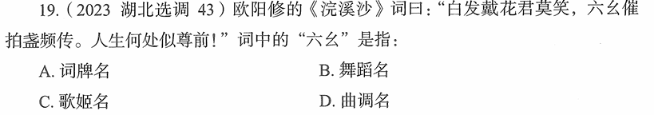

# 错题 96：历史-古代音乐文化-六幺

**来源**：2023年湖北选调第43题

点击查看答案

<b>你的答案</b>：A 
<b>正确答案</b>：D  
<b>详细解答</b>： D项正确:琵琶曲《六幺》是一支唐朝时流行的大曲。《六幺》又名《绿腰》《录要》《乐世》,此曲节奏变化较为丰富,在中国古代文学艺术中有较高的地位,由此乐曲发展出了相应的舞蹈艺术。题干中欧阳修《浣溪沙》词中的"六幺催拍盏频传"指的是在《六幺》乐曲的催促下频频传杯饮酒,这里的"六幺"指的是曲调名。  A项错误:"六幺"不是词牌名,而是曲调名。词牌名如《浣溪沙》《水调歌头》《满江红》等。  B项:虽然《六幺》曲发展出了相应的舞蹈,但在此词中"六幺"主要指的是乐曲,而非舞蹈。  C项:"六幺"不是歌姬名,而是乐曲名称。  
<b>错误原因</b>：不熟悉相关知识

