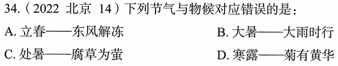

# 错题 97：历史-二十四节气与物候对应

**来源**：2022年北京中考第14题

点击查看答案

<b>你的答案</b>：B 
<b>正确答案</b>：C  
<b>详细解答</b>： A项正确:立春，二十四节气之首，意味着春夏秋冬一个新的轮回正式开始。立春节气分为三候:一候东风解冻;二候蛰虫始振;三候鱼陟负冰。  B项正确:大暑，二十四节气中第十二个节气，夏季的最后一个节气。大暑节气处于三伏天中的中伏前后，是一年之中日照最多、气温最高的时期。大暑节气分为三候:一候腐草为萤;二候土润溽暑;三候大雨时行。大暑时常有大的雷雨出现，大雨使得暑热减弱，天气开始向立秋过渡。  C项错误:处暑，二十四节气中第十四个节气，秋季的第二个节气。处暑，标志着炎热天气到了尾声，暑气渐渐消退，天气由炎热向凉爽过渡。处暑节气分为三候:一候鹰乃祭鸟;二候天地始肃;三候禾乃登。"腐草为萤"是大暑的物候，而非处暑的物候，因此C项对应错误。  D项正确:寒露，二十四节气中第十七个节气，秋季的第五个节气，出现在每年公历的10月7日、8日或9日。寒露节气分为三候:一候鸿雁来宾;二候雀入大水为蛤;三候菊有黄华。黄华，即黄花，指此时菊花已普遍开放。  
<b>错误原因</b>：不了解节气相关知识

