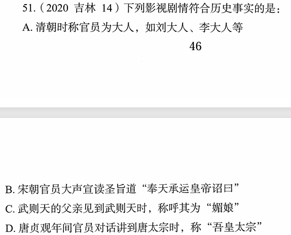

# 错题 98：历史-影视剧历史常识辨析

**来源**：2020年吉林第14题

点击查看答案

<b>你的答案</b>：D 
<b>正确答案</b>：A  
<b>详细解答</b>： A项正确:"大人"这个词最早见于《易经》，初始含义是位高德高之人，后演变成对父母的尊称，并不是用于称呼官员。到了元朝，开始称呼官员为"大人"，后这种称呼一直延续下来，直至清朝。因此，清朝时称官员为"大人"符合历史事实。  B项错误:"奉天承运皇帝诏曰"用于圣旨始于明太祖朱元璋时期。奉天殿是朱元璋和大臣们举行朝议的地方，他用"奉天承运皇帝"自称，以示法统正确。从此之后，圣旨的开头采用"奉天承运皇帝诏曰"。因此，宋朝官员宣读圣旨时出现这句话不符合历史事实。  C项错误:武则天14岁时进宫被赐号"武媚"，亦有人称之为"媚娘"。而其父于武则天12岁时(进宫前)去世，故其父不可能称呼其为"媚娘"。  D项错误:贞观是唐太宗李世民的年号，而太宗是李世民死后的庙号。因此，在他当政期间是不可能被人称为"太宗"的。庙号是皇帝死后在太庙中被供奉时所称呼的名号，生前不能使用。  
<b>错误原因</b>：读题错误，以为是选非题

