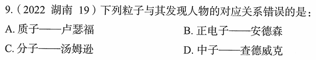

# 错题 99：历史-科学史-粒子发现者

**来源**：2022年湖南第9题

点击查看答案

<b>你的答案</b>：未记录 
<b>正确答案</b>：C  
<b>详细解答</b>： A项正确:卢瑟福是英国著名物理学家，被称为"原子核物理学之父"。1919年，卢瑟福任卡文迪许实验室主任时，用α粒子轰击氮原子核，成功地证实了在原子的中心有个原子核，并在实验中发现了质子。  B项正确:正电子，又称阳电子、反电子、正子，是基本粒子的一种，带正电荷，质量和电子相同，是电子的反粒子。它的存在最早是由英国物理学家狄拉克从理论上预言的。1932年8月2日，美国加州理工学院的安德森等人向全世界庄严宣告，他们发现了正电子。  C项错误:分子是由组成的原子按照一定的键合顺序和空间排列而结合在一起的整体。意大利化学家**阿伏伽德罗**最早提出比较确切的分子概念，他于1811年发表了分子学说。而汤姆逊发现的是**电子**（1897年），因此"分子——汤姆逊"的对应关系错误。  D项正确:中子是组成原子核的核子之一。中子的概念由英国物理学家卢瑟福提出。1932年，英国物理学家查德威克在用α粒子轰击铍的实验中证实了中子的存在。  本题为选非题，故正确答案为C。  
<b>错误原因</b>：不熟悉科学史相应人物

